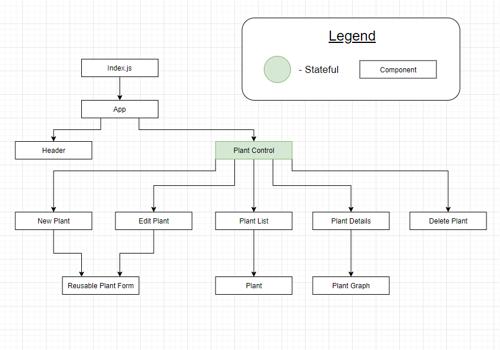

# **Soil-Ent-Green**
Project Initiated: 2021-03-05<br/>
Updated: 2021-03-17

__This repo is the JavaScript/React side of this project.  The Python (Raspberry Pi) side of this project can be found in its own repo, [HERE](https://github.com/CodingMoore/soil-ent-green-python).__ 
<br/>

__A Firestore database is also required for full funcionality__

<br/>
<br/>

## **Project Description**

<br/>

__Save Lives!__

Are you a terrible plant parent?  Does your “green” thumb spread death to all potted life-forms? Despair not, for now you have “Soil-Ent-Green”!

Soil-Ent-Green is a web/hardware application that allows users to remotely gather soil moisture data from their houseplants, and have that data graphed for them in real-time. 

A "Raspberry Pi" running the Soil-Ent-Green Python application is used to gather the data and send it to "Firestore" (NoSQL online database) for storage.  The Soil-Ent-Green React application retrieves the data from Firestore and provides a browser-based user interface. 

The React application has full C.R.U.D. capabilities and utilizes Firebase Authentication, so a user can only access, add, edit, and delete their own plants and database data.  As plant information is stored in the Firestore database with the sensor data, this application could be utilized by the user from any browser/device (if the application were deployed).

The Python application can be modified to account for individual sensor calibration and to adjust the interval between sensor readings.  For the purposes of quick demos, this interval is currently set to 2 seconds.

<br/>

## **Project Explanation**

Soil-Ent-Green is an exercise/experiment in figuring out how a hardware product might be paired with its software without the user being required to edit any code. With respect to this, we are assuming that the "Machine Name" that is entered into the "New Plant" creation form, is written somewhere on the hardware's exterior.  

For the purposes of this project, a Raspberry Pi is used instead of custom hardware.  If this were a "real" product, the hardware would have be factory programmed with this unique "machine name" and database authentication key.

<br/>

## **Required for Use**
* A browser that can run HTML5.
* A Firestore account/database.
* [Node.js](https://nodejs.org/en/)
* A "Raspberry Pi" running the Soil-Ent-Green Python 3 application found [HERE](https://github.com/CodingMoore/soil-ent-green-python).
* Capacitive soil moisture sensor.
* Analog to digital converter (ADC ADS1115 based).

<br/>

## **Installation Instructions**
**Option 1** (direct download)
1) Copy and paste the following GitHub project link into your web browser's url bar and hit enter/return. 
<br/>

    https://github.com/CodingMoore/soil-ent-green-react-v2

2) Download a .zip copy the repository by clicking on the large green "Code" button near the upper right corner of the screen.
3) Right click the .zip file and extract (unzip) it's contents.
4) Open the unzipped folder/files using Visual Studio Code, or similar source code editing program.  Install all required dependencies from the package.JSON folder, and then build the program.  If you are using Node Package Manager, first navigate to the root directory of the project in your console.  You can then type the following commands to install build and run the program.

    <code>npm install</code>

    <code>npm start</code>

    The code will automatically be built, and it should automatically be launched by your default web browser.  If the application does not launch automatically, you can type the following into your web browser's url bar and hit enter/return.
    <br/>
    
    http://localhost:3000/

**Option 2** (via git console/terminal)
1) Open your Git enabled terminal/console and navigate to a directory that you wish to download this project to.
2) Type the following line of code into your terminal/console to automatically download the project to your current directory and hit return/enter

    <code>git clone https://github.com/CodingMoore/soil-ent-green-react-v2</code><br>

3) Once the project has finished downloading, navigate to the root directory of the project in the terminal/console, and type <code>code .</code> and then hit return/enter.

    The project should automatically launch using your default source code editor.

4) Install all required dependencies from the package.JSON folder, and then build the program.  If you are using Node Package Manager, first navigate to the root directory of the project in your console.  You can then type the following commands to install build and run the program.

    <code>npm install</code>

    <code>npm start</code>

    The code will automatically be built, and it should automatically be launched by your default web browser.  If the application does not launch automatically, you can type the following into your web browser's url bar and hit enter/return.
    <br/>
    
    http://localhost:3000/

<br/>

## **Firestore Setup**

1) Go to https://firebase.google.com/ and click "Get Started".
2) Sign-in to your google account, or create a new google account.
3) Click "Create a Project".  If this button is does not appear, first click on "Go to Console" in the upper right-hand corner.
4) Give your project a name, and click the "Continue" button. You may or may not choose to enable "Google Analytics" at this time. Click the "Create project" button.
5) After a few seconds, your project will be built.  Click on the "Continue" button.
6) Open the "Build" section of the vertical menu on the left side of the screen, and click "Firestore".  If this menu is not visible, you may need to widen your browser window.
7) On the Cloud Firestore page, click the "Create database" button.
8) Select "Start in __test mode__" and click the "Next" button. Please note that the security settings for __test mode__ are turned OFF by default. 
9) Select the "Cloud Firestore location" from the drop down menu.  The default option is probably the best choice.  Click the "Enable" button.
10) Click on "Project Overview" at the top of the vertical menu on the left side of the screen. If this menu is not visible, you may need to widen your browser window. Then click on the "web" icon that looks like "</>".
11) Give your app a nickname. and click the "Register app" button.  Do not check the checkbox for "Also set up __Firebase Hosting__ for this app".
12) Copy the "firebaseConfig" settings as you will need to add them to the React ".env" file so that the React application can connect to the database. __For more information on this, read the "Create React .env File" section below.__  This code contains information that needs to be kept __SECRET__, so do not share it. Click on the "Continue to console" button.
13) Open the "Build" section of the vertical menu on the left side of the screen, and click "Firestore".  If this menu is not visible, you may need to widen your browser window. Now click on the "Rules" tab.
14) Replace the rules code with the following and click the "Publish" button...
```
// Note that these rules are not secure and should NEVER be used in production!
rules_version = '2';
service cloud.firestore {
  match /databases/{database}/documents {
    match /{document=**} {
      allow read, write: if true;
    }
  }
}
```
__These rules can be use for demonstration purposes, but they are NOT secure and should never be used for production projects, or to store sensitive or important information.  Anyone who has your database url will be able to read, modify, or delete the contents of your project database.__

15) Open the "Build" section of the vertical menu on the left side of the screen, and click "Authentication".  If this menu is not visible, you may need to widen your browser window. Click on the "Get Started" button.
16) Under the "Sign-in method" tab, there will be a list of "Sign-in Providers".  Click on "Email/Password" and then click "Enable".  It is not recommended that you also enable "Email link".  Click on the "Save" button.

You will be required to gather additional information from Firebase during the Raspberry Pi setup. 

## **Create React .env File**

First create a new folder in the root directory of the Soil-Ent-Green project, called "__.gitignore__".  Copy and paste in the following lines of text...

```
# See https://help.github.com/articles/ignoring-files/ for more about ignoring files.

# dependencies
/node_modules
/.pnp
.pnp.js

# testing
/coverage

# production
/build

# misc
.DS_Store
.env.local
.env.development.local
.env.test.local
.env.production.local
.env

add-read-example.js

npm-debug.log*
yarn-debug.log*
yarn-error.log*
```
Save this file.

Create another new folder in the root directory of the Soil-Ent-Green project, called "__.env__".  Copy and paste in the following lines of text...

```
REACT_APP_FIREBASE_API_KEY = ""
REACT_APP_FIREBASE_AUTH_DOMAIN = ""
REACT_APP_FIREBASE_DATABASE_URL = ""
REACT_APP_FIREBASE_PROJECT_ID = ""
REACT_APP_FIREBASE_STORAGE_BUCKET = ""
REACT_APP_FIREBASE_MESSAGING_SENDER_ID = ""
REACT_APP_FIREBASE_APP_ID = ""
REACT_APP_FIREBASE_MEASUREMENT_ID = ""
```

Paste the firebaseConfig settings values that you copied earlier __INSIDE__ of the quotes of their respective fields.  If you no longer have the firebaseConfig values available, you can find them again by going to you Firebase project, clicking on the gear icon next to "Project Overview", and then clicking on "Project Settings".  From here, you can scroll down to find the firebaseConfig values you need.

Save this new file.

## **React Component Tree Diagram**



<br/>

## **Known Bugs**
* The graph currently shows ALL moisture data from a given plant rather than from a specific timeframe.
* There is currently no confirmation that the user has signed-up or signed-in.
* The 'My Plants' button in the header is only functional when the user is on the login page.  (The 'My Plants' button that appears at the bottom of other pages is always functional.)
* The 'Red Alert' and 'Yellow Alert' functionality is not yet in place. (It will be used to send notifications if the moisture level drops below these levels.)

<br/>

## **Technology Used**
__Hardware:__<br/>
* [Raspberry Pi 3B+](https://www.raspberrypi.org/products/raspberry-pi-3-model-b-plus/) <br/>
* SwitchDoc [Capacitive Plant Moisture Sensor](https://shop.switchdoc.com/products/capacitive-plant-moisture-sensor-grove?pr_prod_strat=copurchase&pr_rec_pid=1447107919916&pr_ref_pid=229332680734&pr_seq=uniform) Corrosion Resistant Grove<br/>
* SwitchDoc [Grove ADC](https://shop.switchdoc.com/products/grove-4-channel-16-bit-analog-to-digital-converter?pr_prod_strat=copurchase&pr_rec_pid=229332680734&pr_ref_pid=229338251294&pr_seq=uniform) - 4 Channel 16 Bit Analog to Digital Converter (based on ADS1115)<br/>
* SwitchDoc [Pi2Grover](https://shop.switchdoc.com/collections/sensors/products/pi2grover-raspberry-pi-to-grove-connector-interface-board) - Raspberry Pi to Grove Connector Interface Board.<br/>
* SwitchDoc [Grove Cable](https://shop.switchdoc.com/products/grove-30cm-universal-4-pin-5-pack?_pos=1&_sid=2bb98f7db&_ss=r) - 30cm Universal 4-pin: 5-pack

__Software:__<br/>
* Python 3<br/>
* React.js<br/>
* JavaScript<br/>
* Node.js<br/>
* CSS<br/>
* Bootstrap<br/>
* Firebase (Firestore) database

<br/>

## **Authors and Contributors**
Authored by: Randel Moore

<br/>

## **Contact**
CodingMoore@gmail.com

<br/>

## **License**

GPLv3

Copyright © 2021 Randel Moore

